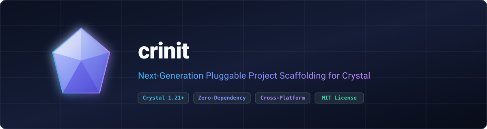

<p align="center">
  
</p>

<p align="center">
  <strong>Next-generation pluggable project scaffolding engine for Crystal. Engineered for arbitrary tree mirroring, macro-safe token replacement, and zero-dependency upstream compiler integration.</strong>
</p>

<p align="center">
  <a href="https://gitlab.com/renich/crinit/-/releases"></a>
  <a href="https://crystal-lang.org/">= 1.21.0" /></a>
  <a href="https://gitlab.com/renich/crinit/-/pipelines"></a>
  <a href="https://gitlab.com/renich/crinit"></a>
  <a href="https://github.com/crystal-ameba/ameba"></a>
  <a href="https://github.com/kdairatchi/flaw"></a>
</p>

<p align="center">
  <a href="https://renich.gitlab.io/crinit/"></a>
  <a href="LICENSE"></a>
  <a href="https://liberapay.com/Renich/donate"></a>
</p>

> **Project Metadata**:
> - **Description**: Next-generation pluggable project scaffolding engine for Crystal. Engineered for arbitrary tree mirroring, macro-safe token replacement, and zero-dependency upstream compiler integration.
> - **Topics / Tags**: `crystal`, `crystal-lang`, `scaffolding`, `generator`, `template-engine`, `compiler`, `cli`, `ameba`, `flaw`, `sphinx`, `crstlint`

---

## 🎯 Intent & Upstream Vision

**`crinit` was created with the explicit intention of being proposed and merged directly into the upstream Crystal compiler (`crystal init`).**

The current implementation of `crystal init` (located in [`src/compiler/crystal/tools/init.cr`](https://github.com/crystal-lang/crystal/blob/master/src/compiler/crystal/tools/init.cr)) has remained frozen for years and exhibits several architectural limitations that hinder production engineering:

1. **Hardcoded File Inventory**: The compiler explicitly declares a static set of eight views: `.gitignore`, `.editorconfig`, `LICENSE`, `README.md`, `shard.yml`, `src/<name>.cr`, `spec/spec_helper.cr`, and `spec/<name>_spec.cr`.
2. **Monolithic Flat Hierarchy**: Modern production architectures require domain-segregated directory structures (`config/`, `containers/`, `packaging/`, `scripts/`, `docs/`). The current tool forces all projects into a single flat file under `src/`.
3. **Mandatory License Lock-In**: The embedded `LICENSE` and `shard.yml` templates strictly mandate the MIT license. Organizations or open-source authors wishing to release software under copyleft terms (GPLv3, AGPLv3, MPL-2.0) are forced to manually overwrite files after initialization.
4. **Zero Community Extensibility**: Framework authors (Kemal, Lucky, Athena, Blueprint) cannot provide canonical skeletons. Instead, they must either maintain bespoke generator shards or instruct developers to perform tedious manual setup.

`crinit` acts as the reference prototype, testbed, and dogfooding tool to prove the design before submitting the formal [Crystal RFC](https://github.com/crystal-lang/rfcs) and Pull Request to [`crystal-lang/crystal`](https://github.com/crystal-lang/crystal).

---

## 💡 Key Highlights & Architectural Principles

- **Zero External Runtime Dependencies**: Uses strictly Crystal's standard library (`OptionParser`, `YAML`, `File`, `Dir`, `Process`, `Path`). No heavy scripting interpreters.
- **Offline-First & Network-Decoupled**: Operates entirely on the local filesystem. Remote template fetching is intentionally decoupled to respect the compiler team's separation between `crystal` and `shards`.
- **100% Backward Compatible**: Drops in as a replacement for `crystal init app <name>` and `crystal init lib <name>`, preserving existing behavior via embedded fallbacks unless overridden.
- **Multi-Platform Native Support**: First-class support across the entire official Crystal tier matrix (Linux, macOS, Windows).
- **Arbitrary Tree Mirroring**: Complete topological freedom over directories, nested namespaces (`src/<name>/init.cr`), assets, and licensing.
- **Macro-Safe Token Substitution**: Prevents syntax collisions with Crystal's native macro delimiters (`{{ ... }}`) while supporting explicit escaping (`\{{ ... \}}`).

---

## 🚀 Quickstart

### Prerequisites

- **Crystal**: `>= 1.21.0`
- **Shards**: Bundled with Crystal
- **GNU Make** & **Git**
- **cRSTLint** (optional, for documentation linting)

### Build and Install Locally

```bash
# 1. Clone repository
git clone https://gitlab.com/renich/crinit.git
cd crinit

# 2. Compile release binary
make build

# 3. Run full verification quality gates
make check

# 4. Install to ~/.local/bin (or sudo make install for /usr/local/bin)
install -m 0755 bin/crinit ~/.local/bin/crinit
```

### Usage

```bash
# Using standard built-in skeletons (100% compatible with crystal init)
crinit app my_application
crinit lib my_library

# Using a custom template installed in your user/system template path
crinit service telemetry_agent

# Using an explicit filesystem template path
crinit --template ~/Projects/crystal/init/app telemetry_agent

# Forcing overwrite or skipping existing files
crinit service telemetry_agent --force
crinit service telemetry_agent --skip-existing
```

---

## 📂 Cross-Platform Template Resolution

`crinit` resolves templates across standard platform directories in the following order:

```
Priority 1: --template <path>                                (Explicit CLI flag)
Priority 2: CRYSTAL_TEMPLATE_PATH                           (Environment variable, split by Process::PATH_DELIMITER)
Priority 3: ./.crystal/templates/<TYPE>                     (Project/Workspace local)
Priority 4: User Data Directory                             (OS-native user path)
Priority 5: System Data Directory                           (OS-native system path or $ORIGIN-relative)
Priority 6: Built-in Defaults                               (Embedded app / lib fallback)
```

### OS Directory Mappings

| Platform | User Template Directory (`Priority 4`) | System Template Directory (`Priority 5`) |
| :--- | :--- | :--- |
| **Linux/BSD** | `$XDG_DATA_HOME/crystal/templates`<br>*(Fallback: `~/.local/share/crystal/templates`)* | `/usr/share/crystal/templates`<br>*(or `$ORIGIN/../share/crystal/templates`)* |
| **macOS** | `~/Library/Application Support/crystal/templates`<br>*(Fallback: `~/.local/share/crystal/templates`)* | `/opt/homebrew/share/crystal/templates`<br>*(or `/usr/local/share/crystal/templates`)* |
| **Windows** | `%LOCALAPPDATA%\crystal\templates`<br>*(Fallback: `%USERPROFILE%\.crystal\templates`)* | `%ProgramFiles%\Crystal\templates`<br>*(or `$ORIGIN\..\share\crystal\templates`)* |

---

## 🛠️ Template Anatomy & Substitution Tokens

A custom template is simply a directory containing files, directories, and an optional manifest:

```
~/.local/share/crystal/templates/service/
├── template.yml                  # Optional metadata and variable prompts
├── .editorconfig
├── .gitlab-ci.yml
├── .ameba.yml
├── GNUmakefile
├── LICENSE                       # Use any license you want (GPLv3, Apache-2.0, etc.)
├── shard.yml
├── config/
│   └── database/
│       ├── connection.cr
│       └── migrations.cr
├── src/
│   ├── {{name}}.cr               # Entry point
│   └── {{name}}/
│       ├── init.cr               # Initialization logic
│       ├── cli.cr
│       └── app.cr
└── spec/
    ├── spec_helper.cr
    └── {{name}}_spec.cr
```

### Standard Replacement Tokens

| Token | Description | Source |
| :--- | :--- | :--- |
| `{{name}}` | Normalized project name | User argument / directory basename |
| `{{module_name}}` | PascalCase Crystal module identifier (e.g. `my-app` $\to$ `MyApp`, `foo-bar` $\to$ `Foo::Bar`) | Derived algorithm |
| `{{author}}` | Author full name | `git config user.name` (fallback: `your-name-here`) |
| `{{email}}` | Author email address | `git config user.email` (fallback: `your-email-here`) |
| `{{github_user}}` | GitHub/GitLab username | `git config github.user` (fallback: `your-github-user`) |
| `{{year}}` | Current four-digit year | `Time.local.year` |
| `{{crystal_version}}` | Current compiler version | `Crystal::VERSION` |

---

## 🏗️ Build System Targets

The repository includes a standard, FHS-compliant `GNUmakefile`:

| Target | Description |
| :--- | :--- |
| `make build` | Compiles optimized release binary to `bin/crinit` (default) |
| `make spec` | Executes complete Crystal spec test suite (`crystal spec`) |
| `make lint` | Runs Ameba static analysis |
| `make flaw` | Runs Flaw security vulnerability scanner |
| `make rstlint` | Validates reStructuredText documentation using `crstlint` |
| `make check` | Runs full zero-defect verification gate (`spec`, `lint`, `flaw`, `rstlint`) |
| `make docs` | Compiles Sphinx HTML documentation suite |
| `make install` | Installs release binary to `/usr/local/bin/crinit` |
| `make clean` | Removes `bin/` build artifacts and documentation build cache |

---

## 📚 Documentation Suite

Full architectural blueprints, functional specifications, and operational playbooks are maintained under [`docs/`](docs/index.rst):

| Guide | Scope & Highlights | Entry Point |
| :--- | :--- | :--- |
| **Business Context & Strategy** | Stakeholder requirements, ROI objectives, and user personas. | [Business Specs](docs/business/spec.rst) |
| **Functional Specifications** | Requirements [FUNC-001]–[FUNC-008] and behavioral contracts. | [Functional Specs](docs/functional/spec.rst) |
| **Technical Architecture** | Process architecture, cross-platform matrix, and token engine spec. | [Technical Specs](docs/technical/spec.rst) |
| **Architecture Decisions (ADRs)** | Immutable logs of architectural decisions and trade-offs. | [ADR Index](docs/adrs/index.rst) |
| **Project Roadmap** | Phased milestone tracking and bidirectional audit matrix. | [Project Roadmap](docs/project/roadmap.rst) |
| **User Manual** | Operational tutorials and template authoring guides. | [User Manual](docs/user/index.rst) |

---

## 🤝 Contributing & Code of Honor

All contributions must adhere to the [Universal Code of Honor](CODE_OF_HONOR.rst) and [Contributing Guidelines](CONTRIBUTING.rst).

---

## 📄 License

- **Software**: MIT License ([LICENSE](LICENSE)).
- **Documentation**: GNU Free Documentation License v1.3 or later ([LICENSE-DOCS](LICENSE-DOCS)).

Copyright &copy; 2026 Rénich Bon Ćirić &lt;renich@evalinux.com&gt;.

---

## 💖 Support & Donations

If you find this project useful and wish to support its ongoing development, please consider donating:

<p align="center">
  <a href="https://liberapay.com/Renich/donate">
    
  </a>
</p>
